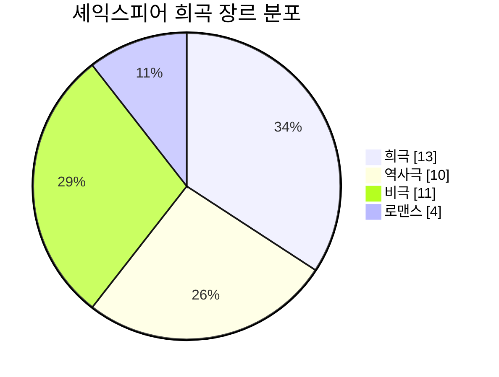
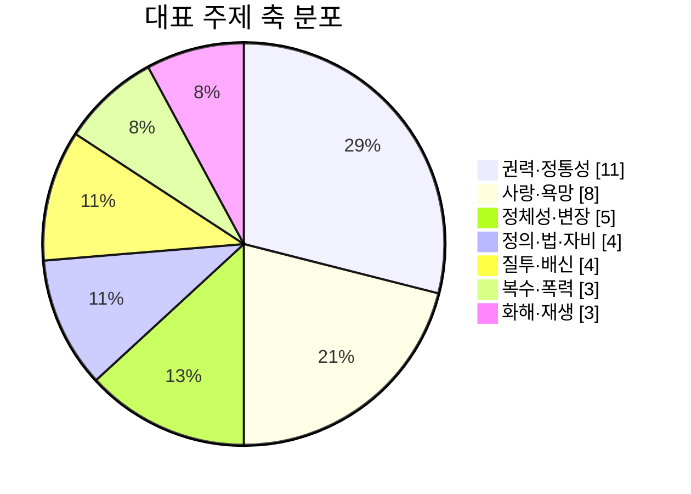
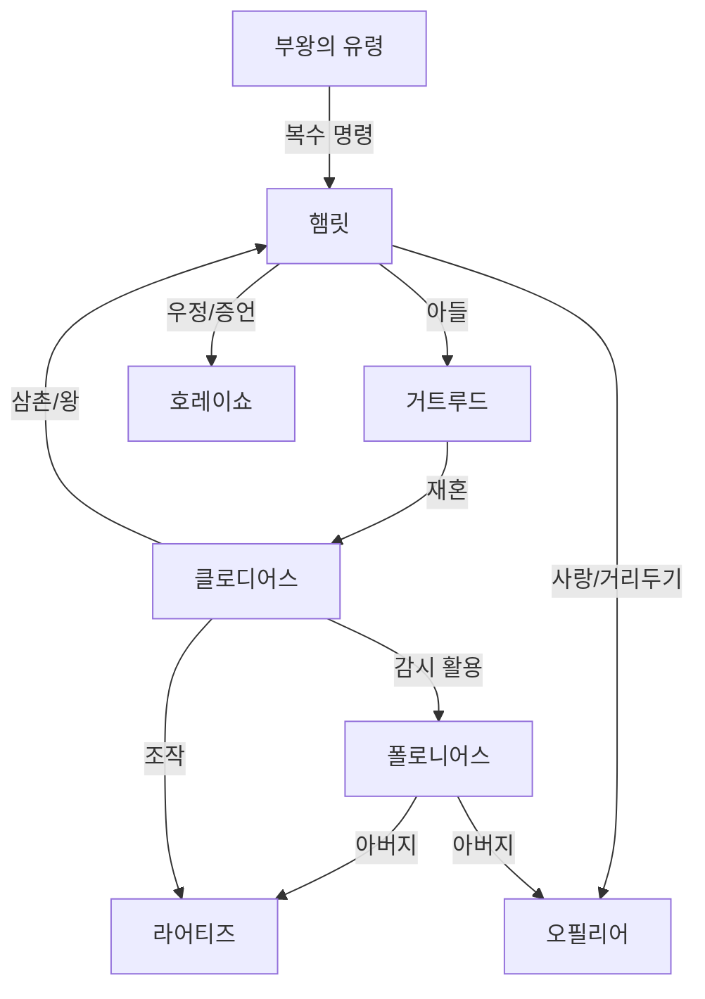

# 셰익스피어 종합 연구 보고서

## Executive Summary

윌리엄 셰익스피어(William Shakespeare)에 관한 연구에서 가장 먼저 확인해야 할 사실은, 그의 “개인적 내면”보다 “문서로 확인되는 생애”와 “전승된 텍스트”가 훨씬 더 견고한 연구 기반이라는 점이다. 남아 있는 기록은 많지 않지만, 세례·혼인·자녀 출생·재산 취득·극단 소속·유언장 같은 문서들은 그가 지방 소도시 출신의 인물이면서도 런던 상업극장의 핵심 작가·배우·지분 소유자로 성장했고, 말년에 재산을 축적한 채 스트랫퍼드로 돌아간 인물임을 분명하게 보여 준다. 따라서 셰익스피어 연구의 핵심은 전기적 공백을 상상으로 메우는 데 있지 않고, 제한된 문서군과 작품 전승의 물질적 증거를 어떻게 연결하느냐에 있다. (Folger Shakespeare Library, 2026; Shakespeare Documented, 2020; Britannica, 2026).

작품 세계는 대체로 초기의 역사극·희극, 중기의 문제극과 대비극, 후기의 로맨스(romances)로 전개된다고 요약할 수 있다. 그러나 이 도식은 어디까지나 길잡이일 뿐이며, 실제로는 법과 자비, 국가와 정통성, 사랑과 욕망, 정체성과 위장, 질투와 배신, 복수와 용서가 장르 경계를 넘나들며 반복된다. 《햄릿》, 《오셀로》, 《맥베스》, 《리어왕》이 비극의 정점으로 자주 언급되지만, 《베니스의 상인》, 《자에는 자로》, 《트로일러스와 크레시다》 같은 작품들은 장르 분류 자체를 흔들며, 《겨울 이야기》와 《템페스트》는 후기 셰익스피어가 비극 이후의 화해·기억·재생을 어떻게 무대화했는지를 보여 준다. (Britannica, 2026; Folger Shakespeare Library, 2026).

셰익스피어 연구의 난점은 단지 “무슨 뜻인가”가 아니라 “어떤 텍스트를 읽고 있는가”라는 질문에 있다. 상당수 희곡이 사소한 오탈자 수준을 넘어, 판본마다 분량·행 순서·배역명·장면 구성 자체가 다르다. 특히 《햄릿》의 Q1/Q2/F1, 《리어왕》의 Q1/F1, 《오셀로》의 Q1/F1, 《로미오와 줄리엣》의 Q1/Q2/F1, 《헨리 5세》의 Q1/F1은 “하나의 원본”을 상정하기 어렵게 만든다. 반대로 《맥베스》, 《템페스트》, 《십이야》 같은 작품은 기본적으로 First Folio 단일 전승에 크게 의존한다. 이 때문에 현대 독자는 단순히 “작품”을 읽는 것이 아니라, 사실상 편집 원칙이 다른 현대판본을 통해 셰익스피어를 읽는다. (Folger Shakespeare Library, 2026; British Academy, 2004).

수용사 측면에서 셰익스피어는 고정된 고전이 아니라, 매 시대가 새로 번역·재배열·공연한 “가변적 장치”였다. 복고왕정기의 개작, 18세기 편집본의 교정주의, 낭만주의의 천재 숭배, 20세기 신비평과 역사비평, 신역사주의와 페미니즘 비평은 모두 서로 다른 셰익스피어를 만들어 냈다. 한국에서는 1906년 이름 소개, 1919년 이후 본격 번역, 1930년대 학교연극, 1960–70년대 신협 중심의 비극 공연, 1990년대 이후 폭발적 재창작과 해외 초청 공연이라는 흐름이 확인된다. 원문은 오래전에 공공영역(public domain)에 들어갔지만, 현대 번역·주석·무대각색·판면은 별개의 권리층을 형성한다는 점도 실무적으로 중요하다. (Britannica, 2026; Folger Shakespeare Library, 2026; KCI/KISS, 2012–2021; GOV.UK, 2021).

## 자료와 방법

이 보고서는 1차 자료를 최우선으로 두고, 그 다음에 대학 출판부·학술지·공신력 있는 기관 자료를 교차 검토하는 방식으로 구성했다. 디지털 1차 자료는 Folger Shakespeare Library, British Library, Shakespeare Birthplace Trust, 그리고 Royal Shakespeare Company의 공개 자료를 우선 사용했고, 작품 연대는 Encyclopaedia Britannica의 표준 연대 범위를 기준선으로 삼았으며, 한국 수용과 번역사는 KCI·KISS에 수록된 연구를 기본 축으로 삼았다. 판본 차이에 대해서는 모든 이문(reading)을 망라하기보다, 현대 독해와 편집 원칙을 실질적으로 바꾸는 “버전 차이” 중심으로 정리했다. (Folger Shakespeare Library, 2026; Britannica, 2026; Shakespeare Documented, 2020; KCI/KISS, 2012–2021).

이 보고서의 한계도 분명하다. 첫째, 셰익스피어 작품의 정확한 “집필 연도”는 대체로 확정값이 아니라 범위 추정치다. 둘째, 협업작과 외전(apocrypha)을 어디까지 정전에 포함할 것인지는 판본 전통마다 다르다. 셋째, 작품별 세부 판본 차이는 특히 《햄릿》과 《리어왕》처럼 독립 판본 편집이 가능한 작품에서 더 심도 있게 연구되어 왔으므로, 전 작품을 동일 밀도로 다루는 것은 학문적으로도 바람직하지 않다. 따라서 본문은 전 작품에 대해 표준화된 요약표를 제공하되, 주요 작품은 별도 상세 분석으로 처리했다. (British Academy, 2004; Folger Shakespeare Library, 2026).

**목차**

- 생애와 시대 배경
- 작품 총람과 비교
- 대표작 분석
- 시와 협업작 그리고 정전 경계
- 텍스트 전승과 저작권 그리고 저자 문제
- 수용사와 비평사
- 참고문헌

## 생애와 시대 배경

셰익스피어의 확인 가능한 생애는 어린 시절의 지역적 기반, 런던의 상업극장, 말년의 재산 관리라는 세 축으로 압축된다. 그는 Stratford-upon-Avon에서 성장했고, 1582년 Anne Hathaway와 혼인했으며, 1590년대 초에는 이미 런던에서 배우이자 극작가로 이름을 얻고 있었다. 이후 그는 Lord Chamberlain's Men의 핵심 인물로 활동했고, 1603년 제임스 1세 즉위 뒤에는 King's Men의 일원으로 남았다. 그는 단지 대본을 공급한 외주 작가가 아니라, 극단 지분과 극장 운영에 얽힌 상업적 행위자이기도 했다. (Folger Shakespeare Library, 2026; Shakespeare Documented, 2020).

교육 배경은 문서로 완전히 증명되지 않지만, 현존 작품이 보여 주는 라틴 고전·수사학·성서·연대기 지식, 그리고 스트랫퍼드 문법학교의 교육 수준을 고려하면, 지역 문법학교(grammar school) 교육을 받았을 가능성이 매우 높다. 다만 이 사실은 “대학을 나오지 않았으므로 작품을 쓸 수 없었다”는 19세기형 저자 대체론이 성립하기 어렵다는 점을 뜻할 뿐이지, 그의 세부 독서 목록이나 청년기 행적을 완전히 복원할 수 있다는 뜻은 아니다. 이 시기의 공백은 이른바 “잃어버린 세월(lost years)”로 남는다. (Folger Shakespeare Library, 2026; Britannica, 2026).

런던 시기의 셰익스피어는 시인·배우·극작가·주주라는 네 역할을 동시에 수행했다. 1593년과 1594년, 역병으로 극장이 닫혀 있던 시기에 그는 《비너스와 아도니스》와 《루크리스의 능욕》을 출판하며 시인으로 공적 명성을 얻었고, 극장이 재개된 뒤에는 배우와 극작가의 이중 경력을 본격화했다. 1599년 그의 극단은 템스 강 남안에 자신의 극장을 세웠고, 이곳에서 대다수 중기·후기 대표작이 상연되었다. 1608년 이후에는 실내극장인 블랙프라이어스도 사용하면서 후기 로맨스의 무대 조건이 달라졌다. (Folger Shakespeare Library, 2026; Shakespeare Documented, 2020).

말년의 셰익스피어는 런던과 스트랫퍼드를 오가며 부동산과 권리 관계를 정리했다. 1597년에는 New Place를 사들였고, 1613년에는 블랙프라이어스 게이트하우스를 공동 매입했다. 1616년 유언장은 여러 부동산, 금전 유증, 친족·동료 관계를 보여 주는 핵심 문서이며, 그가 단순한 예술가가 아니라 재산권을 적극적으로 관리한 도시적 중산층 젠트리(gentry)였음을 드러낸다. (Shakespeare Documented, 2020).

### 생애 연대표

| 연도 | 사건 | 의미 | 주요 자료 |
|---|---|---|---|
| 1564 | 스트랫퍼드에서 출생, 4월 26일 세례 기록 | 출생일은 전통적으로 4월 23일로 기념되나, 확실한 문서는 세례 기록 | 세례·교회 기록 |
| 1582 | 앤 해서웨이와 혼인 | 가정 형성, 이후 장기적 친족·상속 문제의 출발점 | 혼인 허가 문서 |
| 1583 | 딸 수재나 출생 | 가족사 확인 가능 | 세례 기록 |
| 1585 | 쌍둥이 주디스·햄닛 출생 | 햄닛의 1596년 사망은 후대 해석에서 중요 | 세례 기록 |
| 1592 | 로버트 그린의 공격적 언급 | 런던에서 이미 배우·작가로 알려졌음을 보여 주는 최초의 강한 외부 증거 | *Greene’s Groats-worth of Wit* |
| 1593 | 《비너스와 아도니스》 출판 | 시인으로서의 공적 데뷔 | 초판·등록부 |
| 1594 | 《루크리스의 능욕》 출판, 극단 핵심 멤버로 확인 | 시와 연극 양면 활동 | 초판·극단 기록 |
| 1597 | New Place 매입 | 재산 축적과 젠트리화의 증거 | 부동산 문서 |
| 1598 | Francis Meres가 희곡과 “sugared sonnets” 언급 | 동시대 문학장 내 명성 확인 | *Palladis Tamia* |
| 1599 | 글로브 극장 가동 | 중기 대표작 상연 환경 확립 | 극장 관련 법적 문서 |
| 1603 | King's Men으로 재편 | 왕실 후원 확보 | 왕실 허가 문서 |
| 1608 | 블랙프라이어스 실내극장 사용 | 후기 로맨스의 실내 상연 조건 강화 | 극장 지분·법적 기록 |
| 1609 | 《소네트》 초판 | 시집의 공식 출판 | Stationers’ Register, 초판 |
| 1613 | 블랙프라이어스 게이트하우스 공동 매입, 글로브 화재 | 말년 자산 관리와 극장사의 분기점 | 부동산 문서, 상연 기록 |
| 1616 | 유언장 작성, 사망, 성삼위일체교회 매장 | 생애를 닫는 핵심 문서군 | 유언장·교회 기록 |
| 1623 | First Folio 출간 | 정전 형성의 결정적 사건 | Folio 초판 |

주: 연표는 Folger, Shakespeare Documented, Britannica 자료를 교차 정리한 것이다. (Folger Shakespeare Library, 2026; Shakespeare Documented, 2020; Britannica, 2026).

## 작품 총람과 비교

셰익스피어의 정전은 “단일하고 자명한 37개”가 아니다. 현재 통용되는 범위는 대체로 38–40편 사이에서 움직인다. Folger는 38편(《두 귀족 친척》 포함, 《에드워드 3세》 제외)을 실무적 기준선으로 사용하고, Britannica는 《에드워드 3세》와 실전된 《카르데니오》까지 언급한다. 따라서 아래 표는 “현재 가장 널리 읽히는 38편의 희곡 + 핵심 시 작품”을 본체로 삼고, 외전·협업작·실전작은 뒤 절에서 별도로 다룬다. (Shakespeare Documented, 2020; Britannica, 2026; Folger Shakespeare Library, 2026).

주: 장르 분포는 Folger의 현대 분류를 따랐고, 주제 분포는 한 작품에 하나의 “우세 주제 축”만 편의상 배정한 분석적 시각화다. 장르와 주제 모두 학계의 절대 불변 분류가 아니다. (Folger Shakespeare Library, 2026; Britannica, 2026).

### 대표작 비교표

| 작품 | 핵심 갈등 | 구조적 특징 | 텍스트 문제 | 대표 인물 | 오래 남는 질문 |
|---|---|---|---|---|---|
| 햄릿 | 복수 vs 지연, 사유 vs 행위 | 독백 중심, 극중극, 감시 구조 | Q1/Q2/F1이 서로 독립적일 정도로 다름 | 햄릿, 클로디어스, 거트루드, 오필리어, 호레이쇼 | 햄릿의 지연은 도덕인가 심리인가 |
| 오셀로 | 사랑 vs 질투, 내면 오염 | 이야기 전개가 빠르고 압축적 | Q1/F1 차이가 크며 F1에 약 160행 추가 | 오셀로, 데스데모나, 이아고 | 질투는 외부 조작인가 내부 취약성인가 |
| 맥베스 | 예언 vs 야망, 권력의 자기파괴 | 가장 짧은 비극, 환영과 피의 이미지 | F1 단독 전승, Middleton 개입설 지속 | 맥베스, 레이디 맥베스, 세 마녀 | 비극의 원인은 운명인가 선택인가 |
| 리어왕 | 권위 붕괴, 가족 배반, 무의미와 연민 | 이중플롯의 극대화 | Q1/F1이 약 300행 수준으로 달라 독립 편집 가능 | 리어, 코델리아, 고너릴, 리건, 글로스터, 에드거 | 고통은 구원으로 이어지는가 |
| 로미오와 줄리엣 | 개인의 사랑 vs 가문의 폭력 | 5막 직진형 비극, 시적 대화 밀도 높음 | 1597 Q1은 짧고 불안정, Q2가 기준 | 로미오, 줄리엣, 머큐쇼, 수사 로런스 | 비극은 운명인가 사회 구조인가 |
| 템페스트 | 지배 vs 용서, 예술 vs 정치 | 후기 로맨스, 마술·공연성 자체가 주제 | F1 단독 전승 | 프로스페로, 미란다, 에어리얼, 칼리반 | 프로스페로의 포기는 해방인가 통제의 다른 형식인가 |

주: 비교표는 Folger의 작품 소개와 텍스트 해설, Britannica의 작품 연표 및 개요를 바탕으로 요약했다. (Folger Shakespeare Library, 2026; Britannica, 2026).

### 희극

| 작품 | 연대 | 한줄 개요 | 핵심 주제 | 구조·주요 인물 | 대표 구절 | 초판·판본 메모 | 추천 판본 |
|---|---|---|---|---|---|---|---|
| All’s Well That Ends Well | 1601–05 | 헬레나가 버트럼을 얻기 위해 기지를 발휘하는 불편한 결혼극 | 욕망, 계급, 동의 | 5막; Helena, Bertram, Countess | “Love all, trust a few” | F1 단독 전승 | Arden 3 |
| As You Like It | 1598–1600 | 추방된 인물들이 숲에서 정체성과 사랑을 재배열 | 변장, 목가, 언어 유희 | 5막; Rosalind, Orlando, Celia, Touchstone | “All the world’s a stage” | F1 단독 전승 | Arden 3 |
| The Comedy of Errors | 1589–94 | 쌍둥이 두 쌍의 착오가 도미노처럼 겹치는 초기 소동극 | 정체성, 인식 오류 | 5막; Antipholus 형제, Dromio 형제 | “Am I in earth, in heaven, or in hell?” | F1 단독 전승 | Arden 3 |
| Love’s Labour’s Lost | 1588–97 | 학문과 절제가 사랑 앞에서 무너지는 언어극 | 수사학, 욕망, 지연된 결말 | 5막; Navarre, Berowne, Princess, Rosaline | “Light seeking light doth light of light beguile” | Q1 1598, F1; 비교적 안정 | Arden 3 |
| Measure for Measure | 1603–04 | 공권력의 위임이 성도덕과 법 집행의 폭력으로 귀결 | 법, 자비, 위선 | 5막; Duke, Isabella, Angelo, Claudio | “Some rise by sin” | F1 단독 전승; Middleton 개입설 존재 | Arden 3 |
| The Merchant of Venice | 1596–97 | 계약·재판·혼인이 얽힌 법정극이자 문제희극 | 자비, 법, 타자화 | 5막; Portia, Shylock, Antonio, Bassanio | “The quality of mercy” | Q1 1600, F1; 현대 해석이 핵심 | Arden 3 |
| The Merry Wives of Windsor | 1597–1601 | 팔스타프가 윈저의 중산층 여성들에게 골탕 먹는 도시희극 | 시민성, 성별 권력 | 5막; Falstaff, Mistress Ford, Mistress Page | “Better three hours too soon” | Q1 1602 짧고 상이, F1 fuller version | Arden 3 |
| A Midsummer Night’s Dream | 1595–96 | 인간·요정·장인 집단이 한밤의 숲에서 사랑을 오작동시킨다 | 사랑, 환상, 공연 | 5막; Theseus, Oberon, Titania, Puck, lovers | “The course of true love” | Q1 1600, F1; 큰 버전 차이는 제한적 | Arden 3 |
| Much Ado About Nothing | 1598–99 | Hero/Claudio의 명예 플롯과 Beatrice/Benedick의 말싸움 플롯이 병치 | 명예, 소문, 재치 | 5막; Beatrice, Benedick, Hero, Claudio, Don John | “Kill Claudio” | Q1 1600, F1; 대사는 안정·무대지시 혼란 | Arden 3 |
| The Taming of the Shrew | 1590–94 | 결혼과 훈육을 둘러싼 불편한 권력 코미디 | 젠더, 훈육, 공연성 | 5막; Katherine, Petruchio, Bianca | “I see a woman may be made” | F1 단독 전승; 익명극 *A Shrew*와 관계 논쟁 | Arden 3 |
| Twelfth Night | 1600–02 | 난파 이후 쌍둥이와 변장이 사랑과 욕망을 교란 | 성별, 욕망, 멜랑콜리 | 5막; Viola, Olivia, Orsino, Malvolio, Sebastian | “If music be the food of love” | F1 단독 전승 | Arden 3 |
| The Two Gentlemen of Verona | 1590–94 | 우정과 사랑 사이에서 흔들리는 청춘 서사 | 우정, 배신, 여성 주체 | 5막; Valentine, Proteus, Julia, Silvia | “Who is Silvia?” | F1 단독 전승 | Arden 3 |
| The Two Noble Kinsmen | 1612–14 | 두 기사와 에밀리아의 삼각구조를 Fletcher와 함께 변주 | 경쟁, 우정, 욕망 | 5막; Palamon, Arcite, Emilia | “O you heavenly charmers” | Q1 1634; Fletcher 협업 명기 | Arden 3 / New Oxford |

### 역사극

| 작품 | 연대 | 한줄 개요 | 핵심 주제 | 구조·주요 인물 | 대표 구절 | 초판·판본 메모 | 추천 판본 |
|---|---|---|---|---|---|---|---|
| Henry IV, Part 1 | 1596–97 | 국왕·왕자·반란 세력의 부자 관계가 국가 위기와 엮인다 | 정통성, 성장, 정치 연기 | 5막; Hal, Henry IV, Hotspur, Falstaff | “I know you all” | Q1 1598, F1; 전승 안정 | Arden 3 |
| Henry IV, Part 2 | 1597–98 | 왕권 승계와 노령화, 탈락하는 팔스타프가 병치된다 | 권력 승계, 시간, 퇴장 | 5막; Hal, Henry IV, Falstaff | “Uneasy lies the head” | Q1 1600, F1; 전승 안정 | Arden 3 |
| Henry V | 1599 | 아쟁쿠르 승리를 다루는 전쟁·선전·민족국가의 드라마 | 전쟁, 국가, 통치 수사 | 5막+코러스; Henry, Fluellen, Katherine | “Once more unto the breach” | 1600 Q1은 짧고 chorus 부재, F1 fuller | Arden 3 / RSC |
| Henry VI, Part 1 | 1589–92 | 잔다르크와 Talbot, 소년왕의 통치 불안이 교차 | 민족주의, 협업 저작, 분열 | 5막; Henry VI, Talbot, Joan | “Hung be the heavens” | F1 단독; Marlowe/Nashe 협업설 강함 | New Oxford |
| Henry VI, Part 2 | 1590–92 | 귀족 몰락과 Jack Cade 반란이 내전의 전조가 된다 | 붕괴, 선동, 권력 공백 | 5막; Henry VI, Margaret, Gloucester, Cade | “The first thing we do” | 1594 Q (*Contention*)와 F1 revised form | New Oxford |
| Henry VI, Part 3 | 1590–93 | 요크·랭커스터가 왕위를 두고 끝없이 되받아친다 | 내전, 잔혹, 왕권 | 5막; Henry VI, Edward, Margaret, Richard | “O tiger’s heart” | 1595 Q (*True Tragedy*)와 F1 revised form | New Oxford |
| Henry VIII | 1613 | 왕정 위기와 왕비 문제, Wolsey 몰락이 연쇄된다 | 국가 의례, 권력, 탄생의 정치 | 5막; Henry VIII, Wolsey, Katherine, Cranmer | “Men’s evil manners live in brass” | F1 단독; Fletcher 협업설 확고 | New Oxford / Arden |
| King John | 1594–96 | 냉혹한 권력투쟁 속에서 왕권과 외교가 흔들린다 | 정통성, 권모술수 | 5막; John, Arthur, Constance, Bastard | “Commodity, the bias of the world” | F1 단독; 선행극 *Troublesome Reign*과 비교 필요 | Arden 3 |
| Richard II | 1595–96 | 합법적 왕과 실력자 Bolingbroke의 충돌 | 왕권 신성, 퇴위, 연극화된 정치 | 5막; Richard II, Bolingbroke | “This blessed plot, this earth” | Q1 1597 이후 다수 Q; 퇴위 장면 문제 | Arden 3 |
| Richard III | 1592–94 | 리처드의 자기연출과 폭력이 왕위와 몰락을 이끈다 | 야망, 기만, 악의 카리스마 | 5막; Richard, Buckingham, Elizabeth | “Now is the winter” | Q1 1597, F1; 둘 다 중요 | Arden 3 |

### 비극

| 작품 | 연대 | 한줄 개요 | 핵심 주제 | 구조·주요 인물 | 대표 구절 | 초판·판본 메모 | 추천 판본 |
|---|---|---|---|---|---|---|---|
| Antony and Cleopatra | 1606–07 | 로마 제국 형성과 연인의 파국이 동시 진행된다 | 제국, 욕망, 정치적 연기 | 5막; Antony, Cleopatra, Octavius | “Age cannot wither her” | F1 단독 전승 | Arden 3 |
| Coriolanus | 1608 | 전쟁 영웅이 공화정 정치와 민중 앞에서 실패한다 | 귀족주의, 군사 영웅주의 | 5막; Coriolanus, Volumnia, Tribunes | “There is a world elsewhere” | F1 단독 전승 | Arden 3 |
| Hamlet | 1599–1601 | 부친 살해의 복수를 요구받은 왕자가 망설임과 감시의 궁정을 통과한다 | 복수, 사유, 죽음 | 5막; Hamlet, Claudius, Gertrude, Ophelia, Horatio | “To be, or not to be” | Q1 1603, Q2 1604/5, F1 1623가 크게 다름 | Arden 3 / Arden Complete Works |
| Julius Caesar | 1599–1600 | 공화정 수호 명분의 암살이 더 큰 독재의 길을 연다 | 공화정, 군중, 수사학 | 5막; Brutus, Cassius, Caesar, Antony | “Et tu, Brute?” | F1 단독 전승 | Arden 3 |
| King Lear | 1605–06 | 왕국 분할이 가족·국가·언어의 붕괴를 부른다 | 권위, 고통, 무의미와 연민 | 5막; Lear, Cordelia, Goneril, Regan, Gloucester | “Nothing will come of nothing” | Q1 1608, F1 1623 버전 차이 큼 | Arden 3 / separate-version editions |
| Macbeth | 1606–07 | 예언과 야망이 살해 연쇄와 자기파괴로 이어진다 | 권력, 죄책, 환영 | 5막; Macbeth, Lady Macbeth, Witches, Banquo | “Tomorrow, and tomorrow” | F1 단독; Middleton 개입설 지속 | Arden 3 |
| Othello | 1603–04 | 이아고의 조작이 사랑을 질투로 바꿔 파멸시킨다 | 질투, 타자화, 언어 조작 | 5막; Othello, Desdemona, Iago, Emilia | “Beware… of jealousy” | Q1 1622와 F1 1623 차이 큼 | Arden 3 |
| Romeo and Juliet | 1594–96 | 가문 폭력 속 청춘의 사랑이 죽음으로 봉합된다 | 사랑, 운명, 사회적 폭력 | 5막; Romeo, Juliet, Mercutio, Friar Laurence | “Thus with a kiss” | Q1 1597 짧고 불안정, Q2 1599 기준 | Arden 3 |
| Timon of Athens | 1605–08 | 관대함이 배신을 낳고, 인류혐오가 세계 해석이 된다 | 배신, 경제, 혐오 | 5막; Timon, Apemantus, Alcibiades | “I am Misanthropos” | F1 단독; Middleton 협업설 강함 | New Oxford |
| Titus Andronicus | 1589–92 | 복수와 신체 훼손이 극한까지 밀어붙여진다 | 폭력, 복수, 로마성 | 5막; Titus, Tamora, Aaron, Lavinia | “These are their brethren” | Q1 1594; F1에 fly-killing scene 추가 | Arden 3 |
| Troilus and Cressida | 1601–02 | 트로이 전쟁과 연애 서사가 냉소적으로 해체된다 | 가치 붕괴, 냉소, 욕망 | 5막; Troilus, Cressida, Ulysses, Achilles, Thersites | “’Tis valued?” | 1609 Q 문제적 title page; F1 late insertion | Arden 3 |

### 로맨스

| 작품 | 연대 | 한줄 개요 | 핵심 주제 | 구조·주요 인물 | 대표 구절 | 초판·판본 메모 | 추천 판본 |
|---|---|---|---|---|---|---|---|
| Cymbeline | 1608–10 | 비방·질투·변장·실종된 왕자들이 끝내 재결합한다 | 재생, 국가 신화, 정체성 | 5막; Imogen, Posthumus, Iachimo, Cymbeline | “Fear no more the heat o’ th’ sun” | F1 단독 전승 | Arden 3 |
| Pericles | 1606–08 | 난파와 상실 끝에 딸과 아내를 되찾는 순례형 서사 | 시련, 상실, 재생 | 5막; Pericles, Marina, Thaisa | “Yet cease your ire” | 1609 Q1부터 다수 Q, 매우 불안정; F1 없음 | New Oxford / Arden |
| The Tempest | 1611 | 추방된 공작이 마술과 연극성을 통해 복수 대신 용서를 선택한다 | 지배, 식민성, 용서, 예술 | 5막; Prospero, Miranda, Ariel, Caliban | “We are such stuff” | F1 단독 전승 | Arden 3 / RSC |
| The Winter’s Tale | 1609–11 | 질투로 파괴된 가정과 왕국이 긴 시간 뒤 기적처럼 회복된다 | 질투, 회개, 시간, 재생 | 5막; Leontes, Hermione, Perdita, Paulina | “Awake your faith” | F1 단독 전승 | Arden 3 |

### 시

| 작품 | 연대·출판 | 한줄 개요 | 핵심 주제 | 형식·주요 특징 | 대표 구절 | 초판·판본 메모 | 추천 판본 |
|---|---|---|---|---|---|---|---|
| Venus and Adonis | 1593 | 비너스가 아도니스를 욕망하지만 거절당하는 서사시 | 욕망, 거절, Ovid적 에로스 | 6행 연 구조의 narrative poem | “Graze on my lips” | 1593 초판은 현전 유일본; 생전 대중적 성공 | Arden / Oxford Poems |
| Lucrece | 1594 | 성폭력과 수치가 로마 정치질서의 전환을 촉발 | 명예, 수치, 폭력, 정치 | complaint와 minor epic 결합 | “The scar… remain” | 1594 초판; Southampton 헌정 | Arden / Oxford Poems |
| Sonnets | 대개 1590년대 작성, 1609 출판 | 사랑·시간·미·배반·시의 영속성을 변주하는 154편 | 시간, 욕망, 시와 불멸 | 영어 소네트 형식, 연쇄적 배열 | “Shall I compare thee” | 1609 quarto; 말미에 *A Lover’s Complaint* 포함 | Arden Sonnets |
| The Phoenix and the Turtle | 1601 | 불사조와 산비둘기의 합일을 역설적 애도로 노래 | 순수, 진리, 사랑의 형이상학 | 짧은 알레고리시 | “Truth may seem…” | 1601 *Love’s Martyr* 부록 | Oxford Poems |

주: 위 표의 연대는 Britannica chronology를, 작품 개요·초판·텍스트 메모는 Folger works/textual notes와 Shakespeare Documented를 기본으로 정리했다. 대표 구절은 공공영역 원문에서 짧게만 발췌했다. (Britannica, 2026; Folger Shakespeare Library, 2026; Shakespeare Documented, 2020).

## 대표작 분석

### 햄릿

《햄릿》은 “복수극”의 외형을 취하지만, 실제로는 복수 그 자체보다 복수가 요구되는 조건—유령의 권위, 궁정의 감시 체계, 연극과 진실의 관계, 내면 독백의 시간성—을 추적하는 작품이다. 구조적으로 보면 1막은 부친의 죽음과 어머니의 재혼, 유령의 명령이라는 “동기 부여”를 만든다. 2–3막은 지연과 검증, 특히 극중극(the Mousetrap)을 통해 진실을 드러내려는 시도에 집중하고, 4–5막은 우발적 살인·추방·묘지 장면·결투를 거쳐 복수가 이루어지는 동시에 왕조 전체가 붕괴한다. 햄릿, 클로디어스, 거트루드, 오필리어, 라어티즈, 호레이쇼가 각각 “행위”, “권력”, “가족”, “상실”, “대체 복수”, “증언”의 축을 이룬다. “To be, or not to be”는 존재 일반의 추상이 아니라, 행위와 인식이 더 이상 분리될 수 없는 지점에서 나오는 말이다. (Folger Shakespeare Library, 2026).

텍스트 전승 면에서 《햄릿》은 셰익스피어 편집학의 핵심 사례다. 1603년 Q1은 훨씬 짧고 이름·장면 배열이 다르며, 1604/05년 Q2는 대체로 현대판의 기초가 되지만, 1623년 F1에는 Q2에 없는 약 85행이 추가되고 Q2에 있는 약 200행이 빠져 있다. 따라서 “하나의 완전한 햄릿”은 엄밀히 말해 편집자들이 Q2와 F1을 접합(conflation)해 만든 산물에 가깝다. 오늘날 판본 선택은 단일 정본 확정이 아니라 “어느 버전의 햄릿을 읽고 싶은가”의 문제다. (Folger Shakespeare Library, 2026; British Academy, 2004).

### 오셀로

《오셀로》는 규모 면에서는 《햄릿》보다 훨씬 압축적이지만, 그만큼 언어의 침투력이 강하다. 이 작품의 핵심은 사건이 아니라 이아고가 타인의 해석 틀을 점유하는 속도다. 결혼이라는 사적 결단은 곧바로 인종화된 공적 담론으로 이동하고, 이어 군사적 위계와 남성 명예의 언어 속에서 질투가 “증거보다 강한 믿음”으로 굳어진다. 오셀로, 데스데모나, 이아고, 에밀리아의 배치는 사랑·조작·증언·침묵의 구조를 만든다. 에밀리아가 마지막에 진실을 복구하지만 이미 너무 늦었다는 점이 이 작품의 비극성을 강화한다. (Folger Shakespeare Library, 2026).

텍스트상으로는 1622년 Q1과 1623년 F1이 모두 중요하다. F1은 Q1보다 약 160행이 더 많고, 두 판본은 수백 곳의 어휘 차이를 보인다. 이 차이는 단순 오탈자 수준이 아니라 인물의 심리·속도·강조점까지 바꿀 수 있다. 그러므로 《오셀로》를 읽을 때는 “질투 비극”이라는 통념만이 아니라, 어떤 편집자가 어떤 텍스트 전통을 선택했는지를 함께 보아야 한다. (Folger Shakespeare Library, 2026).

### 맥베스

《맥베스》는 셰익스피어 비극 가운데 가장 짧고, 따라서 가장 농축된 작품 중 하나다. 전통적으로 이 작품은 야망의 비극으로 읽혀 왔지만, 실제로는 예언·군사 권력·남성성·환영의 상호작용이 더 중요하다. 세 마녀의 예언은 단순한 외적 운명이라기보다 이미 존재하는 욕망을 드러내는 촉매와 같다. 레이디 맥베스는 결단의 촉진자이지만, 이후 죄책과 수면의 붕괴에서 가장 먼저 무너진다. 구조적으로 이 작품은 살해 이전의 망설임, 살해 이후의 통치 실패, 예언의 재독해와 전쟁, 최종 패배라는 네 중층으로 진행된다. (Folger Shakespeare Library, 2026).

이 희곡은 1623년 F1에서 처음 인쇄되었고, 그래서 현대판은 본질적으로 F1에 의존한다. 다만 오래전부터 일부 장면—특히 노래와 마녀 장면—에 Thomas Middleton의 개입이 있을 수 있다는 논의가 있었고, 오늘날도 판본에 따라 편집 원칙이 달라진다. 즉 《맥베스》는 “단일 전승이라 단순하다”기보다, 오히려 단일 전승이기에 어느 부분을 본래 셰익스피어의 것으로 볼지를 두고 더 민감한 편집 판단이 요구되는 작품이다. (Folger Shakespeare Library, 2026; British Academy, 2004).

### 리어왕

《리어왕》의 위력은 정치적 위기와 형이상학적 공포를 동시에 밀어붙인다는 데 있다. 이 작품은 왕국 분할이라는 논리적 실수에서 출발하지만, 곧 언어 자체의 붕괴—특히 “사랑”과 “효성”을 계산 가능한 말로 환산하려는 시도—가 파국의 근원으로 드러난다. 동시에 글로스터–에드거–에드먼드의 이중플롯은 리어 본줄거리의 거울로 작동하면서, 시각과 통찰, 혈연과 법적 정통성, 자연과 사회 규범을 재배치한다. 이 작품이 “인간의 고통”을 다룬다는 평가는 맞지만, 더 정확히는 고통이 의미를 보장하지 않는 세계를 다룬다고 해야 한다. (Folger Shakespeare Library, 2026).

텍스트상으로는 1608년 Q1과 1623년 F1이 독립 버전으로 취급될 만큼 다르다. F1은 Q1의 약 300행을 결하고, 곳곳에서 장면 구성과 읽기를 변화시킨다. 18세기 이후 다수 편집자는 두 판본을 접합했지만, 20세기 후반 이후에는 “Quarto Lear”와 “Folio Lear”를 별도로 읽는 경향이 강해졌다. 셰익스피어 텍스트 편집의 핵심 난제 하나가 바로 여기에서 나온다. (Folger Shakespeare Library, 2026).

### 로미오와 줄리엣

《로미오와 줄리엣》은 흔히 청춘의 순수한 사랑 이야기로 소비되지만, 사실상 거리 폭력·가문 정치·남성 명예 경쟁이 두 연인을 거의 기계적으로 압박하는 사회 비극이다. 이 작품의 독창성은 사랑의 시적 언어와 도시의 치명적 폭력이 분리되지 않는다는 데 있다. 머큐쇼의 언어가 희극적 재치를 담당하는 동시에 비극의 리듬을 가속하고, 수사 로런스의 중재는 합리적 해결을 시도하지만 오히려 재난의 기술적 매개가 된다. 5막의 결말은 “운명의 농담”이 아니라 정보·시간·사회 갈등이 누적된 결과다. (Folger Shakespeare Library, 2026; Britannica, 2026).

텍스트 전승도 중요하다. 1597년 Q1은 짧고 마지막 3막의 언어·장면이 크게 다르며, 1599년 Q2가 훨씬 길고 더 신뢰 가능한 판본으로 간주된다. 이후 Q3가 Q2를 바탕으로 재간되고, F1은 다시 이 전통을 잇는다. 따라서 현대 독자가 읽는 《로미오와 줄리엣》은 대개 Q2 중심의 재구성물이다. (Folger Shakespeare Library, 2026; Britannica, 2026).

### 템페스트

《템페스트》는 후기 셰익스피어를 대표하는 작품으로, 화해와 재생을 다루면서도 지배와 통제의 그림자를 지우지 않는다. 프로스페로는 복수 가능한 힘을 가졌지만, 마술과 연극성을 통해 상대를 파괴하기보다 연출하고 교정한다. 따라서 이 작품에서 마술은 단순한 판타지가 아니라 무대예술 자체의 비유이며, 에어리얼과 칼리반은 각각 자유로운 정신/비굴한 식민 타자라는 식의 단순 대립을 넘어서 지배의 두 양상을 드러낸다. “We are such stuff / As dreams are made on”은 허무주의의 선언이 아니라, 현실·정치·예술이 모두 구성된 것임을 인정하는 말에 가깝다. (Folger Shakespeare Library, 2026).

이 작품은 1623년 F1에서 처음 인쇄되었고, 이후 모든 현대판이 그 텍스트를 기반으로 삼는다. 그런 의미에서 《템페스트》는 버전 편집의 난제가 있는 작품이라기보다, 하나의 인쇄 전승에서 얼마나 많은 역사적·식민주의적·연극론적 읽기가 파생될 수 있는지를 보여 주는 사례다. (Folger Shakespeare Library, 2026).

## 시와 협업작 그리고 정전 경계

시인으로서의 셰익스피어는 종종 극작가 명성에 가려지지만, 동시대 독자에게는 오히려 《비너스와 아도니스》의 저자로 먼저 알려졌다. 1593년 출판된 이 서사시는 현전 유일 초판본만 남아 있고, 생전 동안 여러 차례 재판될 만큼 인기가 높았다. 1594년의 《루크리스의 능욕》은 보다 중후한 정치적 complaint로서, 《비너스와 아도니스》보다 덜 대중적이지만 셰익스피어의 수사학과 감정 구조를 다른 방식으로 보여 준다. 《소네트》는 1609년 한꺼번에 출판되었으나, 일부는 1590년대에 이미 사적 필사 circulation을 가진 것으로 보인다. 《피닉스와 터틀》은 짧지만 형이상학적 밀도가 높으며, 사랑과 진리의 역설을 응축한다. (Shakespeare Documented, 2020; Folger Shakespeare Library, 2026).

반면 정전의 경계에서는 협업과 외전이 중요해진다. 《페리클레스》, 《헨리 8세》, 《두 귀족 친척》은 오늘날 널리 받아들여지는 협업작이다. 《티몬 오브 아테네》 역시 Middleton 협업설이 강하고, 《헨리 6부 1》은 Marlowe와 다른 작가들의 참여 가능성이 매우 높게 논의된다. 《에드워드 3세》는 최근 수십 년 사이 상당한 지지를 얻어 일부 전집에 포함되었고, *Sir Thomas More* 필사본 중 이른바 “Hand D”는 셰익스피어의 손일 가능성이 높다고 여겨진다. 반면 《카르데니오》는 실전작이고, *Double Falsehood*는 그 흔적일 수 있으나 단정하기 어렵다. *The Passionate Pilgrim*은 제목에 셰익스피어 이름을 내걸었지만 대부분 그의 작품이 아니며, *A Lover’s Complaint*는 여전히 귀속 논쟁의 대상이다. (British Academy, 2004; Shakespeare Documented, 2020; Folger Shakespeare Library, 2026; British Library, 2020).

### 정전 경계 표

| 항목 | 현재 지위 | 쟁점 |
|---|---|---|
| Edward III | 부분적 정전 편입 경향 | 셰익스피어 기여 범위 |
| Sir Thomas More (Hand D) | 부분 필사 기여 가능성 높음 | 필체 판정과 공동 저작 구조 |
| Pericles | 정전 수용 | Wilkins 협업, 부정확한 초기 텍스트 |
| Henry VIII | 정전 수용 | Fletcher 협업 |
| Timon of Athens | 정전 수용 | Middleton 협업 가능성 높음 |
| The Two Noble Kinsmen | 정전 수용 | Fletcher 공저 명시 |
| Cardenio | 실전작 | 기록은 있으나 텍스트 부재 |
| Love’s Labour’s Won | 존재 추정 | 독립작인지 기존작 다른 제목인지 논쟁 |
| A Lover’s Complaint | 논쟁적 귀속 | 소네트 말미 부록, 스타일 측정 논란 |
| The Passionate Pilgrim | 대부분 비정전 | Jaggard의 상업적 귀속 남용 |
| Double Falsehood | 논쟁적 후대 전승 | Cardenio 잔재 여부 |

주: 이 표는 Woudhuysen, Folger, Shakespeare Documented, British Library 자료를 요약한 것이다. (British Academy, 2004; Folger Shakespeare Library, 2026; British Library, 2020).

## 텍스트 전승과 저작권 그리고 저자 문제

셰익스피어 텍스트의 전승은 대본 원고가 거의 남아 있지 않다는 점에서 출발한다. 우리가 실제로 읽는 셰익스피어는 대부분 초기 인쇄본—특히 quartos와 1623년의 First Folio—을 통해 재구성된 것이다. 이 책은 36편을 수록했고, 그중 18편은 이전에 인쇄된 적이 없어서 없었더라면 영영 사라졌을 수 있다. 또한 희곡을 희극·역사극·비극으로 묶어 정전의 틀을 처음 제시했다. 그러나 동시대 동료였던 John Heminges와 Henry Condell이 “true original copies”를 내세웠다고 해서 Folio가 자동으로 최고의 텍스트가 되는 것은 아니다. 실제로 일부 작품은 earlier quarto에서 거의 재판된 것이고, 상당수는 사본·프롬프트북·전문 필경사 자료를 거쳤을 가능성이 있다. (Folger Shakespeare Library, 2026; Britannica, 2026).

20세기 이후 텍스트 연구는 “결정판” 자체를 의심하는 방향으로 진전했다. 신서지학(New Bibliography)은 bad quarto/good quarto, foul papers/promptbook 같은 모형을 세워 원형 복원을 시도했지만, 후대 연구는 그런 복원 서사가 지나치게 낙관적이었음을 지적했다. Woudhuysen이 정리하듯, 셰익스피어 텍스트는 하나의 순수한 저자 원고에서 바로 인쇄된 것이 아니라, 공연·필사·재인쇄·교정의 사회적 생산 과정을 거친 결과물이다. 오늘날 현대 편집본을 고를 때 중요한 것은 “가장 권위 있는 판본”이라는 막연한 수사가 아니라, 해당 판본이 어떤 전승 계열과 편집 철학을 따르는지 파악하는 일이다. (British Academy, 2004; Oxford, Arden, RSC 소개 자료, 2020–2022).

판본 선택의 실무적 기준은 대체로 세 갈래다. 주석과 서지학이 가장 풍부한 연구용 판본으로는 Arden Shakespeare가, 텍스트의 버전성과 공동저작 문제를 넓게 포괄하는 전집으로는 New Oxford Shakespeare가, 공연성과 무대 메모를 함께 보려는 독자에게는 RSC Shakespeare가 유리하다. 입문과 교육용으로는 Folger 단권본이 읽기 편하다. 요컨대 “추천 판본”은 보편적 정답이 아니라 연구 목적의 함수다. (Bloomsbury, 2020–2022; OUP, 2016; RSC, 2022; Folger Shakespeare Library, 2026).

저작권 측면에서 셰익스피어 원문 자체는 오래전에 공공영역에 들어갔다. 영국 정부의 일반 안내처럼 문학·희곡 저작물의 기본 보호기간은 보통 저자 사후 70년이며, 셰익스피어는 1616년에 사망했으므로 원문은 현대 대부분 관할에서 자유 이용 대상이다. 다만 현대 번역은 2차적저작물로서 독자적 저작권을 가질 수 있고, 주석·서문·삽화·판면(layout of published editions) 역시 별도 보호를 받을 수 있다. 한국 저작권 안내서도 번역판 보호기간이 원작과 별도로 기산된다고 설명한다. 따라서 “셰익스피어는 공짜다”라는 말은 원문에 대해서만 대체로 옳고, 특정 번역본·비평본·무대각색본에는 그대로 적용되지 않는다. (GOV.UK, 2021; 한국저작권위원회, 2024; 대한민국 정책브리핑, 2024).

저자 문제(authorship question)에 대해서는 결론이 분명하다. 셰익스피어 동시대와 18세기 후반까지는 그의 저작권을 심각하게 의심하는 흐름이 없었고, 동료 작가와 배우들은 일관되게 그를 저자로 지목했다. Ben Jonson은 First Folio에서 그를 “Sweet Swan of Avon”이라 불렀고, Francis Meres는 1598년 이미 그를 비극·희극 양면의 탁월한 작가로 거론했다. 19세기 이후 Bacon, Marlowe, Oxford 후보설이 반복되었지만, 특히 Oxford설은 그가 1604년에 사망했다는 점 때문에 《리어왕》, 《안토니와 클레오파트라》, 《템페스트》 같은 후기작의 표준 연대와 정면 충돌한다. 현대 정통 학계는 공동저작 문제에는 매우 개방적이지만, “셰익스피어가 셰익스피어가 아니었다”는 주장에는 설득력 있는 증거가 없다고 본다. (Britannica, 2026; Shakespeare Birthplace Trust, 2026; Cambridge, 2013).

## 수용사와 비평사

셰익스피어 수용은 사후 즉시 “무오류의 고전”이 된 과정이 아니었다. 17세기 후반과 복고왕정기에는 고전주의 규범에 맞추기 위해 작품이 과감히 개작되었고, 관객 취향에 맞게 언어·결말·도덕 질서가 수정되었다. 18세기에는 교정과 편집의 시대가 열려 Pope와 Johnson이 각기 다른 방식으로 본문을 손질했고, 19세기 낭만주의는 셰익스피어를 규칙보다 상상력과 인물 창조의 천재로 재평가했다. 20세기에는 Bradley식 성격 중심 독해, 역사비평과 공연사 연구, 신비평의 close reading, 신역사주의·문화유물론·페미니즘이 차례로 중요성을 얻었다. 즉 비평사는 “텍스트의 의미”가 아니라 “무엇을 텍스트의 중심으로 볼 것인가”의 변천사다. (Britannica, 2026).

공연과 영화 수용사도 폭넓다. Folger가 요약하듯, 셰익스피어는 정치적 논평의 매체이자 다른 연극 전통으로의 번안 원천이었고, 영화·오페라·뮤지컬로 지속적으로 변형되었다. BFI 자료만 보아도 1908년의 《Julius Caesar》, 1910년의 《Hamlet》와 《King Lear》, 1913년의 《The Winter’s Tale》 같은 초기 영화 전통이 확인된다. 20세기에는 Laurence Olivier, Akira Kurosawa, Kenneth Branagh, Baz Luhrmann 등 전혀 다른 미학이 서로 다른 셰익스피어를 만들었다. 따라서 셰익스피어 수용은 “원작의 충실한 재현”보다 각 시대가 자신의 시각 체계를 시험하는 장이라고 보는 편이 정확하다. (Folger Shakespeare Library, 2026; BFI, 2026).

한국 수용사는 비교적 늦게 시작되지만 변화 폭은 크다. 권오숙의 정리에 따르면 셰익스피어의 이름은 1906년 Samuel Smiles의 『Self-Help』 번역을 통해 처음 한국어권에 등장했고, 1919년 이전에는 작품 번역이 사실상 이루어지지 않았다. 초기 번역은 대개 셰익스피어 원전이 아니라 Lamb의 *Tales from Shakespeare*와 일본어 중역에 의존했으며, 20세기 후반으로 갈수록 영문 원전에서 직접 번역하는 학술적이고 정확한 판본이 증가했다. 동시에 문학 번역과 공연용 번역의 간극을 줄이려는 시도도 뚜렷해졌다. (권오숙, 2018).

식민지기에는 전문 극단보다 학교연극, 특히 이화여전 같은 여성 고등교육기관이 셰익스피어 상연을 주도한 점이 주목된다. 1920–30년대 조선 극장에서 셰익스피어가 널리 흥행하지 못한 것은 근대극 수용 편향, 번역/상연 기반의 빈약함, 일반 관객의 낯섦 때문이었고, 그런 상황에서 학교 기반의 전막 공연 시도는 예외적 사건이었다. (KCI, 2021).

해방 후와 전쟁기의 혼란을 거쳐 1960–70년대에는 셰익스피어가 “위인”이나 “철학자”가 아니라 본격적인 극작가·연극인으로 수용되기 시작했고, 신협의 비극 공연이 연극 부흥과 셰익스피어 수용의 접점이 되었다. 1990년 이후에는 질적으로 다른 단계가 시작된다. 이현우의 연구에 따르면 1990–2011년 한국에서는 총 411건의 셰익스피어 공연이 이루어졌고, 이 가운데 373건이 한국 제작이었다. 이 시기 한국 셰익스피어의 특징은 민중주의, 여성주의, 샤머니즘, 한국 전통극 기법의 접목으로 요약되며, 오태석·이윤택·양정웅·김명곤 등의 작업이 해외 초청과 비평적 성공을 거두었다. 한국 수용은 단순한 번역 수입이 아니라, 문화적 재기입(cultural reinscription)의 사례로 보아야 한다. (KISS, 2016; KISS, 2016; KCI, 2012).

## 참고문헌

### 1차 자료와 핵심 전승 자료

- Shakespeare, William. *Mr. William Shakespeares Comedies, Histories, & Tragedies* (First Folio, 1623).
- *Shakespeare Documented*의 세례·혼인·부동산·유언장·Stationers’ Register 자료.
- Shakespeare, William. *Venus and Adonis* (1593), *Lucrece* (1594), *Sonnets* (1609), *Love’s Martyr* 속 “The Phoenix and the Turtle” (1601).
- 각 희곡의 early quartos 및 Folio 판본 이미지·텍스트.
- *Sir Thomas More* 필사본 중 이른바 “Hand D” 관련 영국도서관 자료.

### 기관·디지털 자원

- Folger Shakespeare Library. *Shakespeare’s Works*, *Shakespeare in Print*, *Shakespeare’s Life*, *Shakespeare in Performance*.
- British Library. *Shakespeare in Quarto*, *Discovering Literature: Shakespeare and Renaissance*, 관련 블로그와 디지털 컬렉션.
- Shakespeare Birthplace Trust. 저자 문제, 전기, 스트랫퍼드 관련 자료.
- Royal Shakespeare Company. RSC Shakespeare series와 공연 중심 자료.
- Internet Shakespeare Editions. 공연사·텍스트 소개·서지.
- BFI. *Shakespeare on Film* 아카이브.

### 2차 문헌과 평전

- Schoenbaum, Samuel. *William Shakespeare: A Documentary Life*. Oxford University Press.
- Wells, Stanley. *William Shakespeare*. Oxford University Press.
- Wells, Stanley. *Shakespeare: A Life in Drama*.
- Greenblatt, Stephen. *Will in the World: How Shakespeare Became Shakespeare*.
- Shapiro, James. *1599: A Year in the Life of William Shakespeare*.
- Shapiro, James. *Contested Will: Who Wrote Shakespeare?*.
- Edmondson, Paul, and Stanley Wells, eds. *Shakespeare Beyond Doubt: Evidence, Argument, Controversy*. Cambridge University Press.
- Wells, Stanley, and Gary Taylor with John Jowett and William Montgomery. *William Shakespeare: A Textual Companion*.
- Woudhuysen, H. R. “The Foundations of Shakespeare’s Text.”
- Hinman, Charlton. *The Printing and Proof-Reading of the First Folio of Shakespeare*.
- Erne, Lukas. *Shakespeare as Literary Dramatist*.
- Proudfoot, Richard, Ann Thompson, David Scott Kastan, H. R. Woudhuysen, eds. *The Arden Shakespeare Third Series Complete Works*.
- Bate, Jonathan, and Eric Rasmussen, eds. *The RSC Shakespeare: The Complete Works*.
- *The New Oxford Shakespeare: The Complete Works*.

### 한국어 자료

- 권오숙. 「셰익스피어 한국어 번역 100년사: 번역 현황과 번역 태도의 변화 연구」, 『번역학연구』 19.4, 2018.
- 이현우. 「한국의 뉴 밀레니엄 셰익스피어」, 『Shakespeare Review』 48.3, 2012.
- 신정옥. 『한국신극과 셰익스피어 수용사』.
- 「셰익스피어의 한국수용(1) -1906년~1961년까지」, 『드라마 연구』.
- 「셰익스피어의 한국수용(2) -1962년~1979년까지」, 『드라마 연구』.
- 「식민지 조선에서 셰익스피어 인식과 공연 양상 -1920~30년대 학교연극으로서 셰익스피어 극의 상연을 중심으로-」, KCI 수록 논문.

### 정리된 결론

셰익스피어 연구는 세 겹으로 읽어야 한다. 첫째, “문서로 확인되는 삶”이 있다. 둘째, “여러 버전으로 전승된 텍스트”가 있다. 셋째, “각 시대가 새로 만든 셰익스피어”가 있다. 이 세 층을 분리하지 않으면 전기적 상상은 문헌학을 압도하고, 반대로 텍스트 연구는 수용사의 역동성을 놓치게 된다. 가장 생산적인 접근은 셰익스피어를 단일한 천재 신화로 고정하지 않고, 문서·판본·공연·번역·비평이 계속해서 재구성해 온 거대한 문화적 장(field)으로 파악하는 것이다. (Folger Shakespeare Library, 2026; Britannica, 2026; KCI/KISS, 2012–2021).
